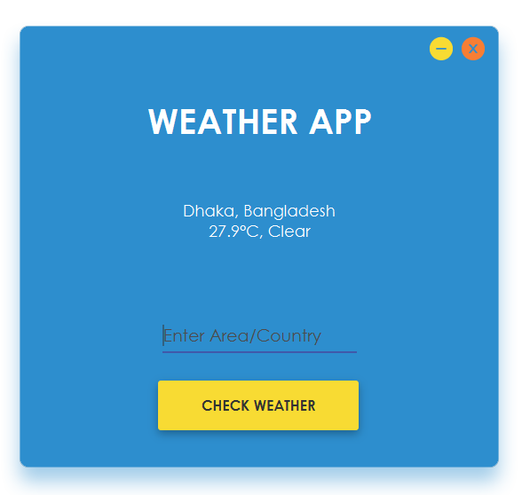

# Weather App using JavaFX
This simple app was created using JavaFX and in here the weather API is used in order to get the weather data of a particular area. Below are some screenshot of the app that I created. If any person is interested to know how I created it they can contact me through my email.

